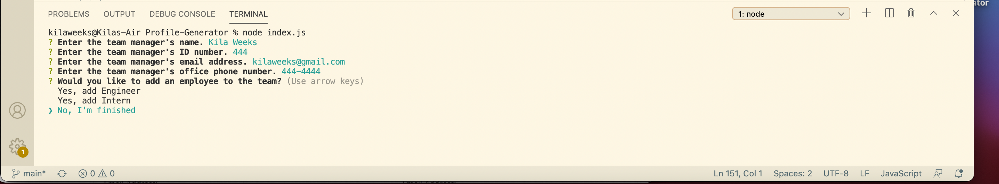
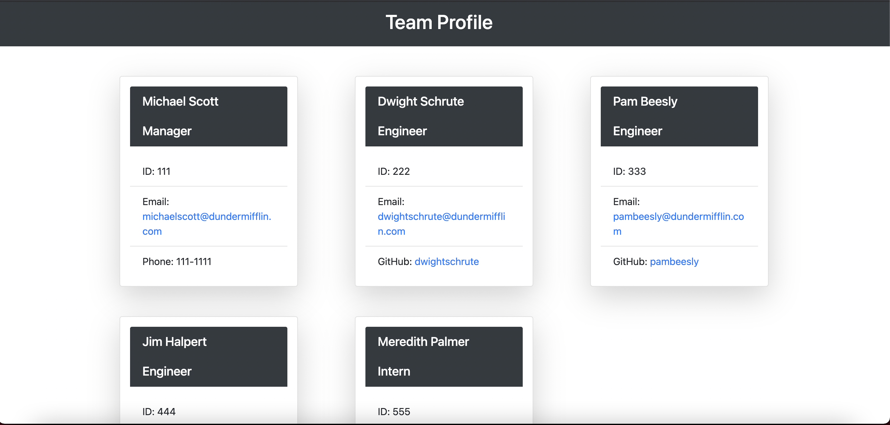
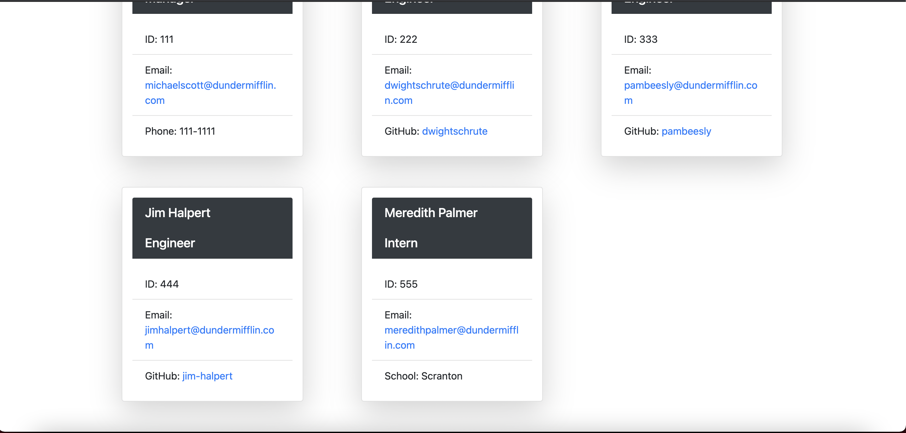

# Profile-Generator

  
  
  ## Description

  Walkthrough Video (https://drive.google.com/file/d/14MtC1JZzbud-rK4S8DcU003ibFqK0frp/view)

  This project creates an HTML page based on command-line user input that shows contact information for members of an engineering team. The app prompts the user to enter info about the manager of the team and then gives the option to add an engineer or an intern. The user can add as many people to the team as they choose.

When the user is done entering information on team members, an HTML document is generated in the "dist" directory titled "generatedHTML." The HTML page shows a card for each employee with their contact information. 

  ## Installation

Before running the app, the user must use npm i to install all dependencies

  ## License

  This project is covered under Apache License 2.0.

  ## Questions

  If you have any questions, please contact me at https://github.com/kilaweeks or kilaweeks@gmail.com.

